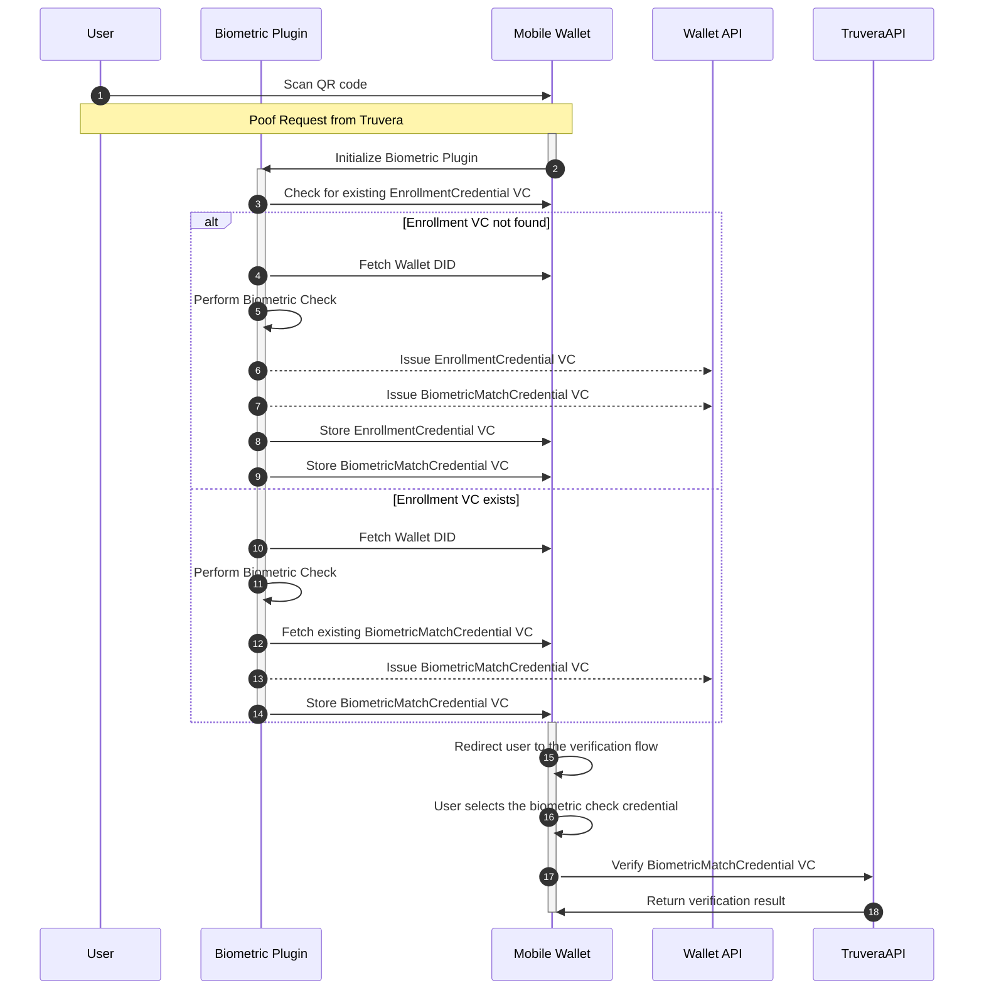

# Biometric Plugin

## Purpose

The biometrics plugin allows for the collection of the user's biometric data as part of credential verification. This allows the verification process to guarantee that only the physical person who was issued the credential can perform the verification.

## Overview

When the wallet detects a request for a biometric check credential, it will trigger the biometric plugin to perform a biometric collection. If the user has not previously enrolled a biometric template, the user can be onboarded with the biometric service which can create an enrollment credential. The enrollment credential can contain the biometric template, or point to a biometric template hosted elsewhere. If the user has previously enrolled, then the biometric collection can be compared with the contents of the enrollment credential.

The enrollment credential also contains a biometric ID, which is a random string that can be used to identify a successful biometric check for a specific use case. For privacy purposes, the biometric ID should not be derived from the user's actual biometric. If the currently collected sample matches the biometric template, then the biometric ID stored in the enrollment credential can be put into a biometric check credential which can be shared without disclosing the user's biometric.

During issuance, the issuer can request a recent biometric check credential and embed the biometric ID and biometric issuer DID into the credential that is being issued.

During verification, the verifier can request a recent biometric check credential alongside the credential with the attributes of interest. If the holder can produce a biometric check credential that contains the same biometric ID as is embedded in the credential of interest and also comes from the same biometric issuer as the credential of interest, then the relying party can be confident that it is the same physical person who was issued the credential.

You can learn more about [biometric bound credentials in the solutions section of the documentation](https://docs.truvera.io/solutions/biometric-bound-credentials).

## Flow

The following diagram details the flow of the biometric plugin:



## How to trigger a biometric verification

To trigger a biometric verification, you need to use a verification template that asks for the biometric attributes. Check the following example:

```json
{
  "id": "Credential 1",
  "name": "Forsur Verification - Biometrics Enrollment",
  "purpose": "Forsur wants to verify the ownership of - Biometrics Enrollment and the validity of the Biometrics Credentials.",
  "constraints": {
    "fields": [
      {
        "path": ["$.credentialSubject.id"]
      },
      {
        "path": ["$.credentialSubject.biometric.id"]
      },
      {
        "path": ["$.credentialSubject.biometric.created"]
      },
      {
        "path": [
          "$.issuer.id",
          "$.issuer",
          "$.vc.issuer.id",
          "$.vc.issuer",
          "$.iss"
        ],
        "filter": {
          "const": "did:dock:5HLbQLSmirNuZVRsdWKbsgdajw9QTGzSFJABSVzMT5EBj5sb"
        },
        "predicate": "required"
      }
    ]
  }
}
```

The presence of the following fields should trigger the biometric check:

```json
{
  "path": ["$.credentialSubject.biometric.id"]
},
{
  "path": ["$.credentialSubject.biometric.created"]
}
```

## How to enable the biometric plugin in the wallet

To enable the biometric plugin in a white-label wallet, you need to edit `src/wallet-sdk-configs.ts` and add your configuration:

```typescript
import { BiometricsProviderConfigs, IDVProviderFactory, setConfigs } from '@docknetwork/wallet-sdk-core/src/biometric-provider';
import { createTruveraIDVProvider, TruveraIDVConfig } from '@docknetwork/wallet-sdk-react-native/lib/truvera-biometric-plugin';
import { IWallet } from '@docknetwork/wallet-sdk-core/src/types';
import { EventEmitter } from 'events';

export const biometricProviderConfigs: BiometricsProviderConfigs<TruveraIDVConfig> = {
  enrollmentCredentialType: 'ForSurBiometricEnrollment',
  biometricMatchCredentialType: 'ForSurBiometric',
  idvConfigs: {
    ecosystemID: '<Ecosystem ID>',
    issuerDID: '<Issuer DID>',
    enrollmentCredentialSchema: '<Enrollment Credential Schema>',
    biometricMatchCredentialSchema: '<Biometric Match Credential Schema>',
    biometricMatchExpirationMinutes: 2,
    walletApiUrl: '<Wallet API URL>',
  },
};

setConfigs(biometricProviderConfigs);

export const idvProviderFactory: IDVProviderFactory = {
  create: (eventEmitter: EventEmitter, wallet: IWallet) => {
    return createTruveraIDVProvider({
      eventEmitter,
      wallet,
      configs: biometricProviderConfigs.idvConfigs,
    });
  },
};

```

The Truvera biometric plugin requires the following configs:

* walletApiUrl: The URL of the wallet API that will be used to issue the credentials
* ecosystemID: The ecosystem ID of the biometric service
* issuerDID: The DID of the issuer
* enrollmentCredentialSchema: The schema of the enrollment credential
* biometricMatchCredentialSchema: The schema of the biometric match credential
* biometricMatchExpirationMinutes: The expiration time of the biometric match credential

## Credential expiration

Credential expiration allows the biometric service provider to specify a maximum length to the validity of a biometric check credential. If the verifier wants to force a refresh of the biometric check more frequently, the verifier can check the credential creation timestamp during verification to ensure it's within their business rules.

## Credential types

This plugin uses two types of credentials to perform the biometric verification:

* Enrollment Credential: This optional credential contains the biometric data of the user. The biometric data is stored in the credential subject field and will be used to perform the biometric match.
* Biometric Match Credential: This credential is issued by the biometric plugin after the biometric match. It contains the biometric ID, the issuer, and the creation date. The verifier can use this credential to check if the biometric match was performed recently and by the same issuer, and it will not contain any biometric data.

## How to bind a biometric to a credential

Before issuing a credential, the issuer may request to verify the biometric check credential. If a valid credential does not exist, the wallet will trigger the biometric plugin to confirm the biometric and issue a credential.

The biometric check credential needs a unique binding ID that can only be generated by that specific user. The issuer can then include in the primary credential, the biometric ID and biometric issuer as attributes that bind that credential to that holder's biometric.

At the time of verification, the verifier can request the biometric check credential along with the primary credential. If the biometric check credential is recent enough, from the same issuer, and contains the same biometric ID, then the verifier can know it is the same holder presenting the credential.

The biometric ID should not contain the user's actual biometric information. When enrolling a holder in the biometric service, it might be useful to issue an enrolment credential containing the biometric template, the generated biometric ID and any other needed information to identify a returning user. This credential can be verified to get the user's information before checking their biometric. By storing this information with the holder, it avoids the biometric service having to store that PII outside of the control of the holder. The holder should only share a biometric enrollment credential with the biometric service that issued it.


## TrustX biometric plugin

The TrustX biometric plugin uses the TrustX API to perform biometric verification and implements the IDVProvider interface.

```typescript
import { BiometricsProviderConfigs, IDVProviderFactory, setConfigs } from '@docknetwork/wallet-sdk-core/src/biometric-provider';
import { createTrustXIDVProvider, TrustXIDVConfig } from '@docknetwork/wallet-sdk-react-native/lib/trustx-biometric-plugin';
import { DataStoreConfigs } from '@docknetwork/wallet-sdk-data-store/src/types';
import { DEFAULT_WALLET_CONFIGS } from '@docknetwork/wallet-sdk-react-native/lib/wallet';
import { IWallet } from '@docknetwork/wallet-sdk-core/src/types';
import { EventEmitter } from 'events';

export const biometricProviderConfigs: BiometricsProviderConfigs<TrustXIDVConfig> = {
  enrollmentCredentialType: 'ForSurBiometricEnrollment',
  biometricMatchCredentialType: 'ForSurBiometric',
  idvConfigs: {
    walletApiUrl: 'https://bank-demo.truvera.io/api',
  },
};

setConfigs(biometricProviderConfigs);

export const idvProviderFactory: IDVProviderFactory = {
  create: (eventEmitter: EventEmitter, wallet: IWallet) => {
    return createTrustXIDVProvider({
      eventEmitter,
      wallet,
      configs: biometricProviderConfigs.idvConfigs,
    });
  },
};

export const dataStoreConfigs: DataStoreConfigs = DEFAULT_WALLET_CONFIGS;

```

## Adding a custom biometric provider

Adding a custom biometric provider will require the development of the plugin following the IDVProvider interface defined at [packages/core/src/biometric-provider.ts](https://github.com/docknetwork/wallet-sdk/blob/master/packages/core/src/biometric-provider.ts). The plugin should implement the following methods:

* enroll: Enrolls the biometric data. It should issue an enrollment credential and a match credential.
* match: Performs the biometric match and if it is valid, returns a biometric match credential.

The plugin should be registered in the wallet-sdk-configs.ts file.
